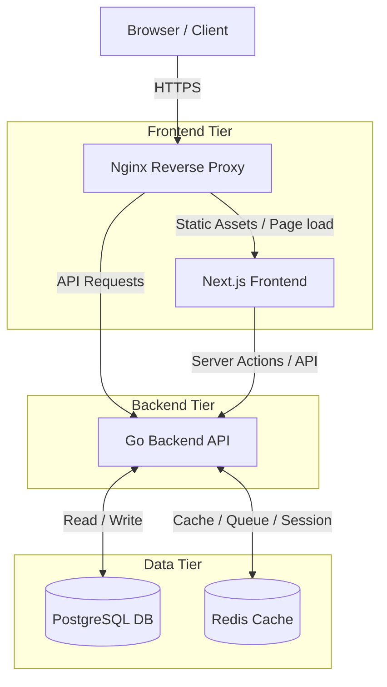
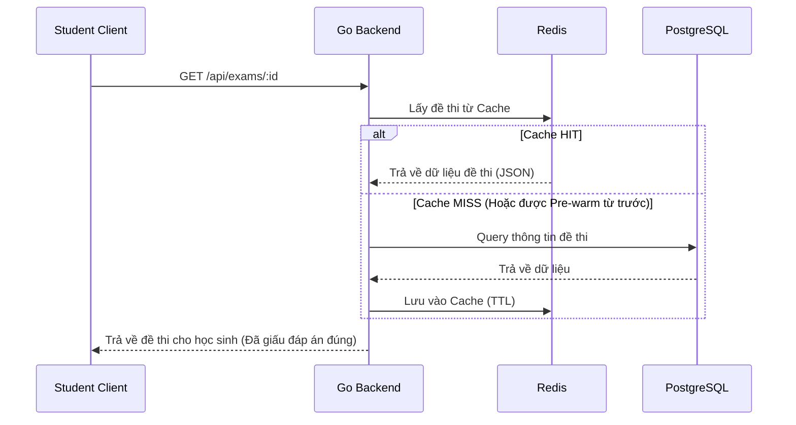
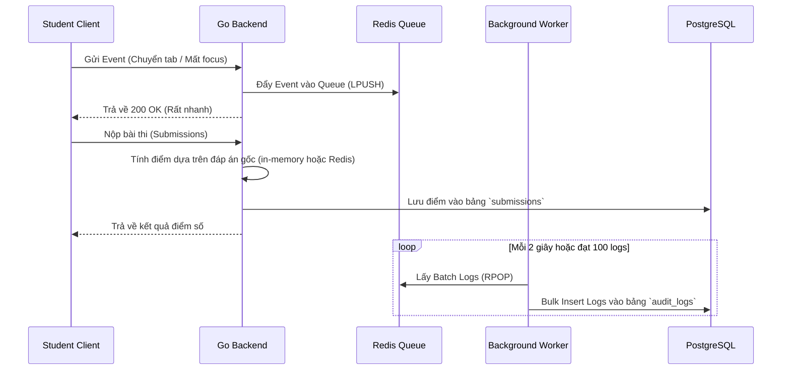

# 🏗️ Kiến trúc Hệ thống (System Architecture) - Toan24h

Tài liệu này mô tả kiến trúc tổng thể, quyết định công nghệ, cấu trúc thư mục và luồng dữ liệu cho dự án **Toan24h** – hệ thống quản lý và thi trắc nghiệm trực tuyến. Kiến trúc được thiết kế dựa trên triết lý **Superpowers** và **Editorial Scholarship**, tập trung vào hiệu năng cao, bảo mật và trải nghiệm người dùng học thuật.

---

## 1. Tổng quan Hệ thống (System Overview)

Hệ thống cung cấp nền tảng phục vụ 3 vai trò (Roles) chính:
- **Admin**: Quản trị hệ thống, quản lý người dùng và cấu hình chung.
- **Teacher (Giáo viên)**: Đóng góp câu hỏi (Question Bank), cấu hình và tạo đề thi thủ công, quản lý kỳ thi, theo dõi kết quả và xuất đề thi (PDF).
- **Student (Học sinh)**: Đăng nhập, tham gia thi trực tuyến trên hệ thống, xem lại kết quả.

**Các yêu cầu phi chức năng cốt lõi (Non-functional Requirements)**:
- **Chịu tải cao (High Concurrency)**: Xử lý mượt mà lượng truy cập đột biến (Spike traffic) lên tới hơn 1,000+ học sinh thi đồng loạt.
- **Tính toàn vẹn & Chống gian lận**: Lưu trữ lịch sử thao tác (audit log) và chống thoát trang.
- **Hỗ trợ học thuật**: Hiển thị chính xác đa phương tiện và công thức Toán học (LaTeX/MathJax).

---

## 2. Tech Stack Chi tiết

Hệ thống sử dụng "The Golden Template: Agency-Grade Web Stack" với cấu hình cụ thể:

| Thành phần | Công nghệ sử dụng | Mục đích & Lý do lựa chọn |
| :--- | :--- | :--- |
| **Frontend** | **Next.js 16.2.6** (App Router), React 19.2.6, Tailwind CSS 4.0 | Hỗ trợ render Server-Side/Client-Side linh hoạt, tối ưu SEO, phong cách thiết kế UI/UX theo chuẩn hệ thống. Sử dụng `react-katex` để render công thức Toán. |
| **Backend** | **Golang 1.26** (Gin / Fiber) | Xử lý đồng thời (goroutines) cực tốt, memory footprint thấp, lý tưởng cho High Concurrency (1000+ users). |
| **Database** | **PostgreSQL** + GORM (ORM) | CSDL quan hệ mạnh mẽ, đảm bảo tính nhất quán (ACID), phù hợp lưu trữ dữ liệu tài khoản, đề thi, lịch sử. |
| **Cache & Queue** | **Redis** | Lưu trữ Session, Caching đề thi, và làm Message Queue tạm thời cho Audit Logs nhằm giảm I/O cho Postgres. |
| **Proxy / LB** | **Nginx** | Reverse proxy, Load Balancer, SSL Termination, phục vụ file tĩnh và cấu hình Rate Limiting. |
| **Infrastructure**| **Docker**, Docker Compose | Container hoá toàn bộ dự án, tạo môi trường đồng nhất giữa Dev và Production. |

---

## 3. Kiến trúc Tổng thể (System Context Diagram)

Sơ đồ mô tả sự tương tác giữa các thành phần trong hệ thống:



---

## 4. Cấu trúc thư mục (Directory Structure)

Dự án áp dụng **Feature-based** cho Frontend và **Clean Architecture (3-layer)** cho Backend Go:

```text
Toan24h/
├── frontend/             # Next.js 14 App Router
│   ├── src/
│   │   ├── app/          # Routing pages (admin/, teacher/, student/)
│   │   ├── components/   # Reusable UI components (Buttons, Modals, LaTeX Render)
│   │   ├── lib/          # Utilities, API fetchers
│   │   ├── stores/       # State management (Zustand/Redux)
│   │   └── types/        # TypeScript interfaces & definitions
├── backend/              # Golang
│   ├── cmd/              # Main applications (Entry point - main.go)
│   ├── internal/         # Private application code (Chỉ dùng trong project)
│   │   ├── config/       # Load môi trường (.env) và configs
│   │   ├── controllers/  # HTTP Handlers / API Routes
│   │   ├── models/       # Database Entities & DTOs
│   │   ├── repository/   # Data Access Layer (Truy vấn Postgres/Redis)
│   │   └── services/     # Business Logic (Nghiệp vụ tạo đề, chấm bài)
│   └── pkg/              # Public libraries (Logger, Utils dùng chung)
├── docker/               # Dockerfiles (cho dev và prod)
├── docs/                 # Documentation (ARCHITECTURE.md, DESIGN.md)
└── docker-compose.yml    # Orchestration các services
```

---

## 5. Thiết kế luồng xử lý và Luồng dữ liệu (Data Flow)

Để giải quyết bài toán nút thắt cổ chai (bottleneck) tại Database khi chịu tải cao, kiến trúc luân chuyển dữ liệu như sau:

### 5.1. Luồng Tải Đề Thi (Spike Read Traffic)



### 5.2. Luồng Nộp Bài & Lưu Audit Log (Spike Write Traffic)

Sử dụng cơ chế **Asynchronous Batching** để không làm nghẽn Database:



---

## 6. Thiết kế các Module Cốt lõi khác

### 6.1. Module Xuất PDF
- **Yêu cầu**: Cần xuất đề thi ra file PDF để giáo viên in ấn.
- **Giải pháp Kiến trúc**: Backend Go sẽ tạo ra bản HTML thuần chứa nội dung LaTeX. Sử dụng thư viện Headless Browser (`chromedp` trong Go hoặc 1 microservice Node.js Puppeteer siêu nhẹ) để render trang HTML thành PDF. File PDF có thể được lưu trữ tạm thời và trả URL về cho người dùng qua Nginx.

### 6.2. Cấu trúc Database (Schema Sơ bộ)
- `users`: (ID, Role, Username, PasswordHash)
- `questions`: (ID, Content_LaTeX, Media_URL, Options_JSON, Correct_Option)
- `exams`: (ID, Title, Config, State)
- `exam_questions`: Bảng trung gian (Exam_ID, Question_ID)
- `submissions`: (ID, Exam_ID, Student_ID, Score, Start_Time, Submit_Time)
- `audit_logs`: (ID, Submission_ID, Event_Type, Meta_Data)

### 6.3. Bảo mật (Security & Authorization)
- Sử dụng **Stateless JWT** lưu trong **HttpOnly Cookie** để ngăn ngừa tấn công XSS.
- Phân quyền (RBAC) xử lý ở lớp Middleware của Golang.
- Dữ liệu `Correct_Option` (Đáp án đúng) tuyệt đối không bao giờ được gửi qua API cấp phát đề thi cho học sinh. Việc chấm điểm chỉ thực hiện ở phía Server (Backend). 
