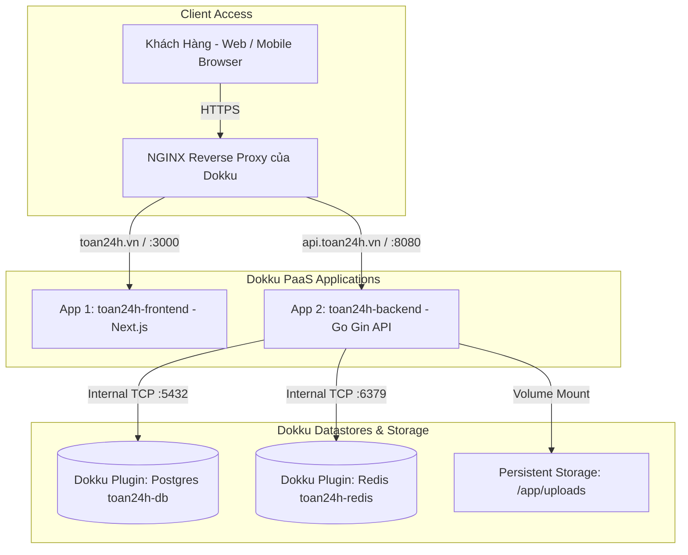

# Hướng dẫn Triển khai Chi tiết Toàn tập Toan24h với Dokku (PaaS)

Tài liệu này chi tiết hóa toàn bộ quy trình đóng gói, cấu hình cơ sở dữ liệu, lưu trữ file tĩnh, tự động hóa SSL HTTPS và triển khai ứng dụng **Toan24h** (Next.js + Go + PostgreSQL + Redis) lên VPS bằng **Dokku PaaS**.

---

## 🌐 Sơ đồ Kiến trúc Hạ tầng trên Dokku



---

## BƯỚC 1: Cài đặt Dokku & Plugins trên VPS

Kết nối SSH vào VPS (`ssh root@IP_VPS_CỦA_BẠN`) và thực hiện lần lượt các lệnh:

### 1.1 Cài đặt Dokku bản mới nhất
```bash
# Tải và chạy script cài đặt Dokku tự động
wget -NP /tmp https://dokku.com/install/v0.34.x/bootstrap.sh
sudo DOKKU_TAG=v0.34.x bash /tmp/bootstrap.sh

# Cấu hình SSH key của bạn vào Dokku để cho phép push code
cat ~/.ssh/authorized_keys | dokku ssh-keys:add admin
```

### 1.2 Cài đặt các Plugin quản lý Database, Redis & SSL
```bash
# 1. Plugin Postgres
sudo dokku plugin:install https://github.com/dokku/dokku-postgres.git postgres

# 2. Plugin Redis
sudo dokku plugin:install https://github.com/dokku/dokku-redis.git redis

# 3. Plugin Let's Encrypt (SSL HTTPS Miễn phí)
sudo dokku plugin:install https://github.com/dokku/dokku-letsencrypt.git letsencrypt
```

---

## BƯỚC 2: Khởi tạo Database & Redis Datastore

Tạo dịch vụ PostgreSQL và Redis độc lập bằng Dokku:

```bash
# 1. Tạo Database PostgreSQL
dokku postgres:create toan24h-db

# 2. Tạo Redis Cache
dokku redis:create toan24h-redis
```

---

## BƯỚC 3: Khởi tạo & Cấu hình App Backend (`toan24h-backend`)

### 3.1 Tạo App Backend & Link Database/Redis
```bash
# 1. Tạo App Backend
dokku apps:create toan24h-backend

# 2. Link Database & Redis vào Backend (Dokku sẽ tự động sinh connection string)
dokku postgres:link toan24h-db toan24h-backend
dokku redis:link toan24h-redis toan24h-backend
```

### 3.2 Gán Ổ đĩa Lưu trữ Ổn định (Persistent Storage) cho Ảnh/Đề thi Uploads
Do container Docker của Dokku có tính chất tạm thời, các file lưu tại `/app/uploads` sẽ bị mất khi deploy bản mới nếu không gán ổ đĩa ngoài VPS:

```bash
# Tạo thư mục ngoài host VPS và gán vào container backend
dokku storage:ensure-directory toan24h-uploads
dokku storage:mount toan24h-backend /var/lib/dokku/data/storage/toan24h-uploads:/app/uploads
```

### 3.3 Thiết lập Biến Môi Trường (Environment Variables) cho Backend
```bash
# Lấy chuỗi kết nối Postgres do Dokku tạo ra gán vào DB_DSN
DATABASE_URL=$(dokku config:get toan24h-backend DATABASE_URL)
REDIS_URL=$(dokku config:get toan24h-backend REDIS_URL)

dokku config:set toan24h-backend \
  DB_DSN="$DATABASE_URL" \
  REDIS_URL="$REDIS_URL" \
  JWT_SECRET="ThayBangChuoiRandomBaoMat32KyTuTroLen!" \
  FRONTEND_URL="https://toan24h.vn" \
  GIN_MODE="release" \
  PORT="8080" \
  GEMINI_API_KEY="YOUR_GEMINI_API_KEY" \
  TELEGRAM_BOT_TOKEN="YOUR_TELEGRAM_BOT_TOKEN" \
  TELEGRAM_BOT_USERNAME="YOUR_BOT_USERNAME" \
  SEPAY_WEBHOOK_TOKEN="YOUR_SEPAY_WEBHOOK_SECRET"
```

---

## BƯỚC 4: Khởi tạo & Cấu hình App Frontend (`toan24h-frontend`)

```bash
# 1. Tạo App Frontend
dokku apps:create toan24h-frontend

# 2. Cấu hình biến môi trường
dokku config:set toan24h-frontend \
  NEXT_PUBLIC_API_URL="https://api.toan24h.vn/api/v1" \
  BACKEND_URL="https://api.toan24h.vn"
```

---

## BƯỚC 5: Cấu hình Domain & Kích hoạt SSL HTTPS

Giả sử domain của bạn là **toan24h.vn** (Đã trỏ bản ghi A về IP VPS):

```bash
# 1. Gán Domain cho Frontend & Backend
dokku domains:set toan24h-frontend toan24h.vn www.toan24h.vn
dokku domains:set toan24h-backend api.toan24h.vn

# 2. Cấu hình Email để nhận thông báo gia hạn SSL
dokku letsencrypt:set toan24h-frontend email your-email@gmail.com
dokku letsencrypt:set toan24h-backend email your-email@gmail.com

# 3. Kích hoạt Cronjob tự động gia hạn SSL Let's Encrypt
dokku letsencrypt:cron-job --add
```

---

## BƯỚC 6: Hướng dẫn Deploy Code lên Dokku

Do repo của bạn chứa cả `backend` và `frontend`, chúng ta dùng **Git Subtree Push** từ máy local để deploy từng thư mục lên Dokku tương ứng:

### 6.1 Thêm Remote Git trên Máy Local
Chạy các lệnh này tại thư mục dự án trên máy tính của bạn:

```bash
# Thêm 2 remote trỏ về Dokku VPS (Thay IP_VPS bằng IP thực tế của bạn)
git remote add dokku-backend dokku@IP_VPS_CỦA_BẠN:toan24h-backend
git remote add dokku-frontend dokku@IP_VPS_CỦA_BẠN:toan24h-frontend
```

### 6.2 Lệnh Deploy thủ công mỗi khi có code mới

```bash
# Deploy Backend (Chỉ đẩy thư mục ./backend)
git subtree push --prefix backend dokku-backend main

# Deploy Frontend (Chỉ đẩy thư mục ./frontend)
git subtree push --prefix frontend dokku-frontend main
```

---

## BƯỚC 7: (Tùy chọn) Tự động hóa Deploy với GitHub Actions

Nếu bạn muốn mỗi khi `git push origin main` lên GitHub thì GitHub sẽ tự kích hoạt Dokku deploy, tạo file `.github/workflows/deploy-dokku.yml`:

```yaml
name: Deploy Toan24h to Dokku

on:
  push:
    branches:
      - main

jobs:
  deploy:
    runs-on: ubuntu-latest
    steps:
      - name: Checkout code
        uses: actions/checkout@v4
        with:
          fetch-depth: 0

      - name: Deploy Backend to Dokku
        uses: dokku/github-action@master
        with:
          git_remote_url: 'ssh://dokku@${{ secrets.VPS_HOST }}:22/toan24h-backend'
          ssh_private_key: ${{ secrets.VPS_SSH_KEY }}
          git_push_flags: '--force'
          subtree_path: 'backend'

      - name: Deploy Frontend to Dokku
        uses: dokku/github-action@master
        with:
          git_remote_url: 'ssh://dokku@${{ secrets.VPS_HOST }}:22/toan24h-frontend'
          ssh_private_key: ${{ secrets.VPS_SSH_KEY }}
          git_push_flags: '--force'
          subtree_path: 'frontend'
```

---

---

## BƯỚC 8: Hướng dẫn Truy cập Ứng dụng trên Mạng Internet sau khi CI/CD hoàn tất

Sau khi tạo xong file CI/CD `.github/workflows/deploy-dokku.yml` ở Bước 7, thực hiện các bước sau để kích hoạt ứng dụng lên mạng và truy cập:

### 8.1 Cấu hình GitHub Secrets
Vào GitHub Repository của bạn: **Settings** > **Secrets and variables** > **Actions** -> Chọn **New repository secret** để thêm 2 secret:
- `VPS_HOST`: Địa chỉ IP của VPS (ví dụ: `160.236.192.96`)
- `VPS_SSH_KEY`: Nội dung đầy đủ của SSH Private Key kết nối VPS.

### 8.2 Commit & Push Code lên GitHub
Chạy các lệnh sau tại máy local:
```bash
git add .
git commit -m "ci: setup dokku deployment workflow"
git push origin main
```

### 8.3 Theo dõi Tiến trình Deploy tự động
1. Truy cập tab **Actions** trên GitHub Repository.
2. Theo dõi Workflow **Deploy Toan24h to Dokku** chạy tự động cho đến khi hoàn tất (hiện tích xanh ✅).

### 8.4 Truy cập Ứng dụng
- **Trường hợp 1: Đã gắn Domain (ở Bước 5)**
  - Web Frontend: `http://toan24h.vn` (hoặc `https://toan24h.vn`)
  - API Backend: `http://api.toan24h.vn/api/v1/exams`
- **Trường hợp 2: Chưa có Domain (Truy cập tạm bằng IP VPS `160.236.192.96`)**
  - Kiểm tra URL do Dokku cấp bằng lệnh trên VPS:
    ```bash
    dokku urls toan24h-frontend
    dokku urls toan24h-backend
    ```
  - Cấu hình gán cổng 80 cho Frontend nếu muốn mở trực tiếp qua IP VPS:
    ```bash
    dokku ports:set toan24h-frontend http:80:3000
    ```

---

## BƯỚC 9: Bật SSL HTTPS bảo mật

Sau khi mở ứng dụng thành công trên trình duyệt qua HTTP, chạy 2 lệnh sau trên VPS để bật chứng chỉ bảo mật HTTPS xanh:

```bash
dokku letsencrypt:enable toan24h-backend
dokku letsencrypt:enable toan24h-frontend
```

