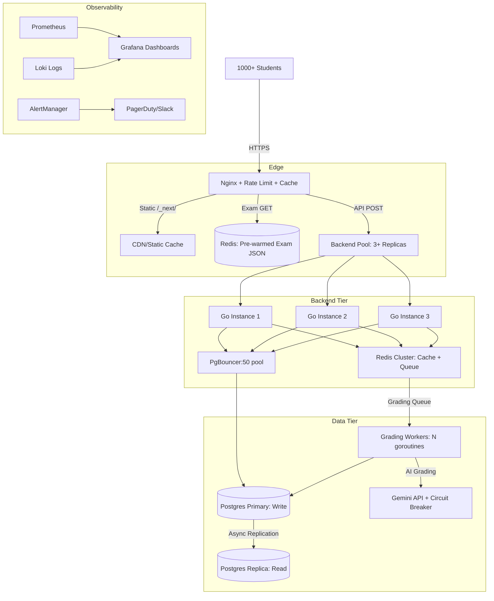

Vì sao có 2 phiên bản thanh công cụ?
2: SharedEditorCard: Được thiết kế riêng cho màn hình Quản lý/Giáo viên (Tạo câu hỏi/bài giảng). Nó được bọc trong một thẻ (Card) có icon, có tiêu đề, và hỗ trợ nhiều tùy chỉnh phức tạp hơn để soạn thảo đề bài.
3: RichTextEditor: Được thiết kế tối giản, loại bỏ các đường viền thừa (border-none) để nhúng trực tiếp vào giao diện Làm bài thi (Exam Taking) của học sinh. Ở màn hình này, học sinh chỉ cần một thanh công cụ gọn gàng để trả lời tự luận mà không cần các tính năng quản lý phức tạp.
4: Bạn thử tải lại trang và

---

# 🔒 Security Audit - Các lỗ hổng bảo mật cần khắc phục

*Ngày audit: 2026-09-10*

## 🔴 Critical (Nghiêm trọng - Fix ngay)

### 1. JWT Secret mặc định yếu
**File:** `backend/internal/utils/jwt.go:26`
**Vấn đề:** `secret = "default_secret_key"` - nếu không set env `JWT_SECRET`, token có thể bị forge.
**Fix:** Bắt buộc set `JWT_SECRET` trong `.env`, không cho phép default.

### 2. Self-registration với role tùy ý (Privilege Escalation)
**File:** `backend/internal/handlers/auth_handler.go:48-51`
**Vấn đề:** User đăng ký tự set `role: "admin"`/`"teacher"` → leo thang đặc quyền.
**Fix:** Force `role = "student"` khi self-register, chỉ admin tạo teacher/admin qua API riêng.

### 3. CORS misconfiguration (Wildcard + Credentials)
**File:** `backend/internal/routes/routes.go:18-33`
**Vấn đề:** `Access-Control-Allow-Origin: *` + `Allow-Credentials: true` → vi phạm spec, browser từ chối, nhưng cấu hình sai cho phép CSRF.
**Fix:** Whitelist origin cụ thể (`config.Env.FrontendURL`), không dùng `*`.

### 4. Cookie thiếu Secure & SameSite
**File:** `backend/internal/handlers/auth_handler.go:110-114`
**Vấn đề:** `SetCookie(..., false, true)` → `Secure=false`, `SameSite=Default` (Lax). Trên HTTP bị đánh cắp, prod thiếu `SameSite=Strict/Lax`.
**Fix:** `Secure=true` (HTTPS), `HttpOnly=true`, `SameSite=Strict` cho auth cookies.

### 5. Không rate limit login/register
**File:** `backend/internal/routes/routes.go:54-58`
**Vấn đề:** Brute-force password, enum email, DoS.
**Fix:** Thêm middleware rate limit (5 req/min/IP) cho `/auth/login`, `/auth/register`.

### 6. IDOR thiếu audit log
**File:** `backend/internal/handlers/user_handler.go:58-80`
**Vấn đề:** Admin đổi status bất kỳ user nào - OK quyền, nhưng **không có audit log** ai đã thay đổi.

---

## 🟠 High (Cao - Fix trong sprint này)

### 7. Access token 24h, không có revoke/blacklist
**File:** `backend/internal/utils/jwt.go:33, 52`
**Vấn đề:** Token bị đánh cắp → truy cập 24h. Refresh token 7 ngày. Không có token blacklist khi logout/ban user.
**Fix:** Implement token blacklist (Redis) + refresh token rotation + reuse detection.

### 8. Static file serving không auth
**File:** `backend/internal/routes/routes.go:36`
**Vấn đề:** `r.Static("/uploads", "./uploads")` → ai biết URL đều tải được ảnh/de thi.
**Fix:** Bảo vệ `/uploads` bằng signed URL hoặc auth middleware.

### 9. Password policy quá yếu
**File:** `backend/internal/handlers/auth_handler.go:22`
**Vấn đề:** Min 6 ký tự, không enforce complexity.
**Fix:** Min 12 ký tự, yêu cầu uppercase, lowercase, number, special char.

### 10. Frontend middleware trust cookie `userRole` không HttpOnly
**File:** `frontend/src/middleware.ts:19`
**Vấn đề:** Cookie `userRole` **không HttpOnly** (line 113: `false`) → XSS có thể sửa role = admin. Backend vẫn check JWT nhưng frontend redirect sai.
**Fix:** Đặt `HttpOnly=true` cho `userRole`, `userGrade` cookies; hoặc đọc role từ JWT claim thay vì cookie.

---

## 🟡 Medium (Trung bình - Keo keo)

### 11. SQL Injection tiềm ẩn
**File:** `backend/internal/handlers/question_handler.go:260`
**Vấn đề:** `fmt.Sprintf("(%s) OR id IN (SELECT ...", combinedQuery, combinedArgs...)` - dùng `fmt.Sprintf` cho WHERE clause thay vì parameterized query hoàn toàn.
**Fix:** Dùng GORM builder hoặc parameterized query thuần túy.

### 12. Không validate file upload
**File:** `backend/internal/handlers/upload_handler.go` (route `/uploads/temp` public)
**Vấn đề:** Có thể upload shell, oversized file, path traversal.
**Fix:** Validate MIME type, max size, sanitize filename, store outside webroot.

### 13. Exposed stack trace/internal error
**File:** Nhiều handler: `c.JSON(500, gin.H{"error": err.Error()})`
**Vấn đề:** Leak thông tin DB, path, logic.
**Fix:** Log error chi tiết server-side, trả client generic message `"Internal server error"`.

### 14. Missing security headers
**File:** `backend/internal/routes/routes.go`
**Vấn đề:** Không có CSP, HSTS, X-Frame-Options, X-Content-Type-Options.
**Fix:** Thêm middleware security headers (gin-contrib/secure hoặc custom).

### 15. Telegram ID không verify ownership
**File:** `backend/internal/handlers/auth_handler.go` (LinkTelegram)
**Vấn đề:** Có thể gán TelegramID của user khác → nhận notification không phải của mình.
**Fix:** Verify ownership qua OTP/code trước khi link.

---

## 🟢 Low / Hardening (Tăng cường)

| # | Vấn đề | Khuyến nghị |
|---|--------|-------------|
| 16 | Bcrypt cost 14 (tốt) nhưng không có argon2 | Nâng cấp argon2id nếu muốn future-proof |
| 17 | Không có audit log cho hành động nhạy cảm (đổi role, đổi pass, xóa user) | Thêm audit log table + middleware |
| 18 | Không có account lockout sau N lần login sai | Thêm failed login counter + lockout 15 phút |
| 19 | Refresh token rotation không có (reuse detection) | Implement refresh token rotation + reuse detection |
| 20 | Chưa có penetration test | Chạy OWASP ZAP / Burp Suite trước production |

---

## ✅ Checklist hành động ưu tiên

- [ ] Set `JWT_SECRET` mạnh (32+ chars) trong `.env` production
- [ ] Fix self-registration role bypass (`auth_handler.go`)
- [ ] Cấu hình CORS whitelist origin (`routes.go`)
- [ ] Bật `Secure=true`, `HttpOnly=true`, `SameSite=Strict` cho cookie auth
- [ ] Thêm rate limit login/register (5 req/min/IP)
- [ ] Thêm security headers (CSP, HSTS, X-Frame-Options)
- [ ] Validate file upload (type, size, path traversal)
- [ ] Implement token blacklist/revoke on logout/password change
- [ ] Thêm audit log cho admin actions
- [ ] Penetration test trước khi production

---

# 🧩 Component Reusability Audit - Các vấn đề tái sử dụng component

*Ngày audit: 2026-09-10*

## 📊 Tóm tắt Component Atom (UI Primitives)

| Component | Trạng thái tái sử dụng | Vấn đề chính |
|-----------|----------------------|--------------|
| `Button` | ✅ Tốt | 7 variants, 4 sizes, loading state, forwardRef |
| `Input` | ⚠️ Cơ bản | Thiếu label, helper text, prefix/suffix, textarea |
| `Card` | ✅ Tốt | Compound components (Header/Content/Footer) |
| `Badge` | ✅ Tốt | 10 variants, 3 sizes - nhưng hardcoded difficulty variants |
| `Label` | ⚠️ Thiếu | Không có htmlFor, required star hardcoded |
| `Checkbox` | ✅ Tốt | Label built-in, error state, forwardRef |
| `RadioOption` | ⚠️ Niche | Chỉ dùng cho multiple choice, không generic |
| `Icon` | ✅ Tốt | Wrapper lucide-react, type-safe |
| `MathText` | ✅ Domain-specific | Render LaTeX inline/block tốt |
| `ConfirmModal` | ⚠️ Đóng gói logic | Tự render portal, khó customize animation |
| `Pagination` | ❌ **Tight coupling** | Dùng `next/navigation` - **không dùng được ở client-only** |

---

## 🔴 Vấn đề nghiêm trọng nhất

### 1. **Pagination紧耦合 Next.js Router** (`Pagination.tsx:18-20`)
```tsx
const router = useRouter();
const pathname = usePathname();
const searchParams = useSearchParams();
// → Không dùng được trong:
//   - Client components không có router (exam taking)
//   - Storybook/test không Next.js
//   - Pre-rendered static pages
```
**Fix:** Tách logic pagination ra hook `usePagination`, component chỉ render UI.

### 2. **RichTextEditor & SharedEditorCard: 90% code trùng lặp** (~300 lines each)
- Cùng MenuBar (speech recognition, math, image, youtube)
- Cùng `preprocessMath`, `useEditor` setup
- Chỉ khác: **layout wrapper** (Card có header/title/icon vs inline)

### 3. **ContentQuestion hardcode render logic** (`ContentQuestion.tsx:66-80`)
```tsx
// Grid 2 cột options - không config được
<div className="grid grid-cols-1 md:grid-cols-2 gap-3">
// Badge variant cho correct answer hardcode
'bg-primary/5 border-primary/30'
```

---

## 🟡 Cải tiến đề xuất

### A. **Tách Pagination thành UI + Hook**
```tsx
// hooks/usePagination.ts
export function usePagination({ currentPage, totalPages, onChange }) {
  const handlePageChange = (page) => { /* logic */ };
  const pages = useMemo(() => getPageNumbers(currentPage, totalPages), [...]);
  return { pages, handlePageChange };
}

// components/ui/Pagination.tsx - chỉ render
export function Pagination({ pages, currentPage, onPageChange, ... }) {
  // Không dùng useRouter, usePathname, useSearchParams
}
```

### B. **Unify Editor: BaseEditor + Variants**
```tsx
// components/ui/editor/BaseEditor.tsx (shared logic)
export function BaseEditor({ 
  content, onChange, extensions = [], 
  toolbarConfig = 'full', // 'full' | 'math-only' | 'minimal'
  readOnly, placeholder, minHeight 
}) {
  // Shared: useEditor, preprocessMath, speech recognition, sync logic
  // Render toolbar based on config
}

// components/questions/creator/editor/RichTextEditor.tsx
export function RichTextEditor(props) {
  return <BaseEditor {...props} toolbarConfig={props.mathOnly ? 'math-only' : 'full'} />
}

// components/questions/creator/editor/SharedEditorCard.tsx
export function SharedEditorCard({ title, icon, ...props }) {
  return (
    <CardWrapper title={title} icon={icon}>
      <BaseEditor {...props} toolbarConfig='full' />
    </CardWrapper>
  )
}
```

### C. **Input mở rộng thành FormField**
```tsx
// components/ui/FormField.tsx
export interface FormFieldProps {
  label?: string;
  error?: string;
  helperText?: string;
  required?: boolean;
  children: React.ReactElement; // Input, Textarea, Select
}
```
→ Wrapper cho Label + Input + Error + HelperText (accessible, consistent)

### D. **ContentQuestion config-driven**
```tsx
interface ContentQuestionProps {
  // ...existing
  renderOptions?: (options, correctAnswer) => ReactNode; // override
  optionLayout?: 'grid-2' | 'grid-1' | 'list';
  showCorrectBadge?: boolean;
  correctBadgeVariant?: BadgeVariant;
}
```

### E. **Badge: tách difficulty variants ra constant**
```tsx
// lib/constants.ts
export const DIFFICULTY_BADGE_VARIANTS: Record<string, BadgeVariant> = {
  'Nhận biết': 'diff-nb',
  'Thông hiểu': 'diff-th',
  'Vận dụng': 'diff-vd',
  'Vận dụng cao': 'diff-vdc',
};

// QuestionCard.tsx:70
variant={DIFFICULTY_BADGE_VARIANTS[difficulty] || 'info'}
```

---

## 📋 Checklist ưu tiên Component

| Priority | Task | Effort | Impact |
|----------|------|--------|--------|
| 🔴 | Extract `usePagination` hook, decouple Pagination từ Next router | 2h | Cho phép dùng ở exam taking, Storybook, static pages |
| 🔴 | Create `BaseEditor` unified component, dedupe RichTextEditor/SharedEditorCard | 4h | Giảm 300+ lines duplicate code, dễ maintain |
| 🟠 | Create `FormField` wrapper (Label + Input + Textarea + Select + Error) | 2h | Consistent form UX, accessibility |
| 🟠 | Make `ContentQuestion` options rendering configurable | 1h | Reuse cho exam taking, teacher preview, result review |
| 🟢 | Move difficulty badge map to constants | 0.5h | Single source of truth |
| 🟢 | Add `htmlFor` support to Label, prefix/suffix to Input | 1h | Better a11y, flexibility |
| 🟢 | Make ConfirmModal use headless UI pattern (render prop) | 2h | Customizable animation/content |

---

## 💡 Kiến trúc đề xuất cho `/components/ui`

```
ui/
├── primitives/           # Atom - zero deps, fully generic
│   ├── Button.tsx
│   ├── Input.tsx
│   ├── Textarea.tsx      # NEW
│   ├── Select.tsx        # NEW  
│   ├── Label.tsx
│   ├── Checkbox.tsx
│   ├── RadioGroup.tsx    # NEW (generic, không phải RadioOption)
│   ├── Badge.tsx
│   ├── Card.tsx
│   ├── Icon.tsx
│   └── index.ts
├── composites/           # Molecule - có logic/UI opinionated
│   ├── FormField.tsx     # NEW (Label + Input + Error + Helper)
│   ├── ConfirmModal.tsx  # Refactor: headless
│   ├── Pagination.tsx    # Refactor: pure UI
│   ├── Avatar.tsx        # NEW
│   ├── Dropdown.tsx      # NEW
│   └── Toast.tsx
├── domain/               # Domain-specific (math, exam)
│   ├── MathText.tsx
│   ├── MathKeyboard.tsx
│   └── QuestionRenderer.tsx  # NEW (từ ContentQuestion)
├── editor/               # Editor ecosystem
│   ├── BaseEditor.tsx    # NEW (shared TipTap logic)
│   ├── RichTextEditor.tsx    # Wrapper BaseEditor
│   ├── SharedEditorCard.tsx  # Wrapper BaseEditor + Card
│   ├── MathExtension.tsx
│   └── preprocessMath.ts
└── hooks/                # Shared logic
    ├── usePagination.ts
    ├── useEditor.ts
    └── useSpeechRecognition.ts
```

---

# 🐳 Infrastructure Audit - Docker, Nginx, Redis

*Ngày audit: 2026-09-10*

## 🔴 Critical (Phải fix ngay)

### 1. **Postgres/Redis password hardcoded** 
**File:** `docker-compose.yml:8`, `docker-compose.prod.yml:8`
```yaml
POSTGRES_PASSWORD: secretpassword  # ❌ Production!
```
**Fix:** Dùng `${POSTGRES_PASSWORD}` từ `.env`, không commit password thực.

### 2. **Redis không có password & expose port ra host**
**File:** `backend/internal/config/redis.go:18`, `docker-compose.yml:19`
```go
Password: "",  // ❌ Không có auth
ports: "6379:6379"  // ❌ Expose ra host network
```
**Fix:** Set `requirepass` trong `redis.conf`, chỉ internal network (bỏ `ports` trong prod).

### 3. **Backend Dockerfile thiếu CA certificates**
**File:** `docker/backend.Dockerfile:17`
```dockerfile
FROM alpine:latest  # ❌ Không có ca-certificates -> HTTPS call fail (Telegram, AI grading)
```
**Fix:** `apk add --no-cache ca-certificates tzdata` trong runtime stage.

---

## 🟠 High - Performance & Production Ready

### 4. **Nginx: Thiếu caching, compression, rate limiting**
**File:** `nginx/nginx.conf`
```nginx
# ❌ Không có gzip, proxy_cache, rate_limit, SSL config
```
**Thêm config cần thiết:**
```nginx
# Gzip compression
gzip on; gzip_vary on; gzip_types text/plain text/css application/json application/javascript text/xml;

# Rate limiting
limit_req_zone $binary_remote_addr zone=api:10m rate=100r/s;
limit_req_zone $binary_remote_addr zone=login:10m rate=5r/m;

# Proxy cache cho static assets
proxy_cache_path /var/cache/nginx levels=1:2 keys_zone=static_cache:10m inactive=60m;
```

### 5. **Không có health check endpoint cho Docker**
**File:** `docker-compose.prod.yml:34-35` (backend), frontend tương tự
```yaml
# ❌ Không có healthcheck -> Docker không biết service healthy
restart: unless-stopped
```
**Thêm healthcheck:**
```yaml
healthcheck:
  test: ["CMD", "wget", "-q", "--spider", "http://localhost:8080/api/health"]
  interval: 30s; timeout: 10s; retries: 3; start_period: 10s
```

### 6. **Redis: Không config persistence, maxmemory, eviction policy**
**Cần tạo file:** `docker/redis.conf`
```conf
requirepass ${REDIS_PASSWORD}
maxmemory 256mb
maxmemory-policy allkeys-lru
save 900 1; save 300 10; save 60 10000
appendonly yes
```

### 7. **Frontend static assets caching headers thiếu**
Next.js standalone output cần Nginx cache `/_next/static/` 1 năm.

---

## 🟡 Medium - Developer Experience & Observability

### 8. **Không có `.env.example` template**
File `.env` bắt buộc nhưng không có template cho dev mới.

### 9. **Logging: Không có centralized logging driver**
```yaml
# Thêm cho tất cả services:
logging:
  driver: "json-file"
  options:
    max-size: "10m"
    max-file: "3"
```

### 10. **Postgres: Không có init scripts, backup strategy**
Cần volume cho init SQL, pg_dump cron job.

### 11. **Nginx: Không có SSL/HTTPS config cho production**
Cần certbot/letsencrypt hoặc mount certs cho production.

---

## 🟢 Low - Nice to have

| # | Cải tiến |
|---|----------|
| 12 | Go version: 1.21 → 1.23 (security patches) |
| 13 | Node version: 20 → 22 LTS (frontend Dockerfile) |
| 14 | Add `docker-compose.override.yml` cho dev local |
| 15 | Resource limits (CPU/memory) cho từng container |
| 16 | Nginx: security headers (CSP, HSTS, X-Frame-Options) |
| 17 | Redis: sentinel/cluster cho HA |
| 18 | Postgres: read replica, connection pooling (PgBouncer) |

---

## 📋 Checklist Fix ưu tiên Infrastructure

| Priority | Task | File(s) |
|----------|------|---------|
| 🔴 | Move secrets to `.env`, remove hardcoded passwords | `docker-compose*.yml` |
| 🔴 | Add Redis password, disable port expose | `docker-compose.yml`, `redis.go`, new `docker/redis.conf` |
| 🔴 | Add `ca-certificates` to backend runtime image | `docker/backend.Dockerfile` |
| 🟠 | Add gzip, rate limit, proxy cache to Nginx | `nginx/nginx.conf` |
| 🟠 | Add healthcheck to backend/frontend | `docker-compose.prod.yml` |
| 🟠 | Add Redis config (maxmemory, persistence) | New `docker/redis.conf` |
| 🟠 | Add logging driver + rotation | `docker-compose.prod.yml` |
| 🟢 | Create `.env.example` | New file |
| 🟢 | Add resource limits | `docker-compose.prod.yml` |
| 🟢 | SSL/HTTPS config for Nginx | `nginx/nginx.conf` |

---

## 🛠 File cần tạo/sửa

### `docker/redis.conf` (new)
```conf
requirepass ${REDIS_PASSWORD}
maxmemory 256mb
maxmemory-policy allkeys-lru
save 900 1
save 300 10
save 60 10000
appendonly yes
```

### `docker/backend.Dockerfile` (fix)
```dockerfile
# Stage 2: Runtime
FROM alpine:latest
RUN apk add --no-cache ca-certificates tzdata  # ADD THIS
WORKDIR /root/
COPY --from=builder /app/main .
EXPOSE 8080
CMD ["./main"]
```

### `nginx/nginx.conf` (enhance)
```nginx
events { worker_connections 1024; }

http {
    include /etc/nginx/mime.types;
    default_type application/octet-stream;

    # Rate limiting
    limit_req_zone $binary_remote_addr zone=api:10m rate=100r/s;
    limit_req_zone $binary_remote_addr zone=login:10m rate=5r/m;

    # Gzip
    gzip on; gzip_vary on; gzip_types text/plain text/css application/json application/javascript;

    upstream frontend { server frontend:3000; }
    upstream backend { server backend:8080; }

    server {
        listen 80;
        server_name localhost;

        # Frontend Next.js
        location / {
            proxy_pass http://frontend;
            proxy_http_version 1.1;
            proxy_set_header Upgrade $http_upgrade;
            proxy_set_header Connection 'upgrade';
            proxy_set_header Host $host;
            proxy_cache_bypass $http_upgrade;
        }

        # Login rate limit
        location /api/auth/login {
            limit_req zone=login burst=3 nodelay;
            proxy_pass http://backend;
            proxy_set_header Host $host;
            proxy_set_header X-Real-IP $remote_addr;
            proxy_set_header X-Forwarded-For $proxy_add_x_forwarded_for;
        }

        # API rate limit
        location /api/ {
            limit_req zone=api burst=50 nodelay;
            proxy_pass http://backend;
            proxy_set_header Host $host;
            proxy_set_header X-Real-IP $remote_addr;
            proxy_set_header X-Forwarded-For $proxy_add_x_forwarded_for;
        }

        # Static assets caching (1 year)
        location /_next/static/ {
            proxy_pass http://frontend;
            add_header Cache-Control "public, max-age=31536000, immutable";
        }

        # Uploads
        location /uploads/ {
            proxy_pass http://backend;
            proxy_set_header Host $host;
        }
    }
}
```

### `docker-compose.prod.yml` (additions)
```yaml
services:
  postgres:
    # ... existing ...
    environment:
      POSTGRES_USER: ${POSTGRES_USER}
      POSTGRES_PASSWORD: ${POSTGRES_PASSWORD}
      POSTGRES_DB: ${POSTGRES_DB}
    # Add healthcheck
    healthcheck:
      test: ["CMD-SHELL", "pg_isready -U ${POSTGRES_USER} -d ${POSTGRES_DB}"]
      interval: 30s; timeout: 10s; retries: 3

  redis:
    image: redis:7-alpine
    command: redis-server /etc/redis/redis.conf
    volumes:
      - redis_data:/data
      - ./docker/redis.conf:/etc/redis/redis.conf:ro
    # REMOVE ports in production
    networks: [toan24h_net]
    healthcheck:
      test: ["CMD", "redis-cli", "ping"]
      interval: 30s; timeout: 10s; retries: 3

  backend:
    # ... existing ...
    healthcheck:
      test: ["CMD", "wget", "-q", "--spider", "http://localhost:8080/api/health"]
      interval: 30s; timeout: 10s; retries: 3; start_period: 10s
    logging:
      driver: "json-file"
      options: { max-size: "10m", max-file: "3" }

  frontend:
    # ... existing ...
    healthcheck:
      test: ["CMD", "wget", "-q", "--spider", "http://localhost:3000"]
      interval: 30s; timeout: 10s; retries: 3; start_period: 10s

  nginx:
    # ... existing ...
    logging:
      driver: "json-file"
      options: { max-size: "10m", max-file: "3" }
```

---

## 📝 `.env.example` (new file)
```env
# Database
POSTGRES_USER=admin
POSTGRES_PASSWORD=changeme_strong_password_here
POSTGRES_DB=toan24h
DB_DSN=host=postgres user=admin password=changeme_strong_password_here dbname=toan24h port=5432 sslmode=disable TimeZone=Asia/Ho_Chi_Minh

# Redis
REDIS_PASSWORD=changeme_redis_password_here
REDIS_URL=redis:6379

# JWT
JWT_SECRET=changeme_32_char_minimum_secret_key_here

# Frontend
NEXT_PUBLIC_API_URL=/api/v1
BACKEND_URL=http://backend:8080
FRONTEND_URL=https://your-domain.com

# App
GIN_MODE=release
NODE_ENV=production
```

---

# 🚀 High Concurrency & Resilience - Tăng khả năng chịu tải & Chống sập

*Ngày audit: 2026-09-10*

Mục tiêu: Hỗ trợ **1,000+ học sinh thi đồng thời** (spike traffic), 99.9% uptime, graceful degradation.

---

## 🔴 Critical - Backend Scaling & Connection Management

### 1. **Go Backend: Horizontal scaling + Connection Pool tuning**
**Vấn đề:** Single backend instance, default GORM pool (max 10 connections) → bottleneck ở DB.
**Fix:**

```go
// config/database.go - Tune connection pool
func ConnectDB(dsn string) error {
    db, err := gorm.Open(postgres.Open(dsn), &gorm.Config{
        PrepareStmt: true, // Cache prepared statements
    })
    if err != nil { return err }

    sqlDB, _ := db.DB()
    sqlDB.SetMaxOpenConns(100)     // Tăng từ 10 → 100
    sqlDB.SetMaxIdleConns(20)      // Giữ 20 idle
    sqlDB.SetConnMaxLifetime(30 * time.Minute)
    sqlDB.SetConnMaxIdleTime(10 * time.Minute)
    config.DB = db
    return nil
}
```

```yaml
# docker-compose.prod.yml - Scale backend
services:
  backend:
    deploy:
      replicas: 3  # Minimum 3 instances
      resources:
        limits:
          cpus: '1.0'
          memory: 512M
        reservations:
          cpus: '0.5'
          memory: 256M
```

### 2. **Postgres: PgBouncer connection pooler (BẮT BUỘC cho 1k+ concurrent)**
**Vấn đề:** Mỗi Go connection = 1 process Postgres (10MB RAM). 1000 connections = 10GB RAM → OOM.
**Fix:** Thêm PgBouncer giữa Go và Postgres.

```yaml
# docker-compose.prod.yml
services:
  pgbouncer:
    image: edoburu/pgbouncer:latest
    ports: ["6432:6432"]
    volumes:
      - ./docker/pgbouncer.ini:/etc/pgbouncer/pgbouncer.ini:ro
    depends_on: [postgres]
    networks: [toan24h_net]

  backend:
    environment:
      - DB_DSN=host=pgbouncer user=admin password=... dbname=toan24h port=6432 pool_mode=transaction
```

```ini
# docker/pgbouncer.ini
[databases]
toan24h = host=postgres port=5432 dbname=toan24h

[pgbouncer]
pool_mode = transaction
max_client_conn = 1000
default_pool_size = 50
reserve_pool_size = 10
reserve_pool_timeout = 5
```

### 3. **Redis: Pipeline & Lua scripts cho atomic operations**
**Vấn đề:** Mỗi round-trip Redis = network latency. Spike traffic làm chậm.
**Fix:** Dùng Pipeline cho batch, Lua script cho atomic check-and-set.

```go
// internal/services/exam_cache.go
func (s *ExamCacheService) WarmupExams(examIDs []string) error {
    pipe := config.RedisClient.Pipeline()
    for _, id := range examIDs {
        key := "exam:" + id
        pipe.Get(ctx, key)  // Queue all GETs
    }
    _, err := pipe.Exec(ctx) // 1 round-trip
    return err
}

// Atomic "claim exam slot" - chống race condition
const claimSlotScript = `
local current = redis.call('GET', KEYS[1])
if current == false then
    return redis.call('SET', KEYS[1], ARGV[1], 'EX', ARGV[2], 'NX')
end
if tonumber(current) < tonumber(ARGV[3]) then
    return redis.call('INCR', KEYS[1])
end
return 0
`
```

---

## 🟠 High - Database Optimization

### 4. **Postgres: Partitioning, Indexing, Read Replica**
```sql
-- Partition audit_logs by month (giảm scan time)
CREATE TABLE audit_logs (
    id UUID, submission_id UUID, event_type VARCHAR, created_at TIMESTAMPTZ
) PARTITION BY RANGE (created_at);

CREATE INDEX idx_submissions_exam_user ON submissions(exam_id, user_id);
CREATE INDEX idx_questions_grade_topic ON questions(grade, topic) WHERE parent_id IS NULL;
```

```yaml
# Read replica cho SELECT queries (exam loading, leaderboards)
services:
  postgres-replica:
    image: postgres:15-alpine
    command: >
      postgres -c wal_level=replica 
               -c max_wal_senders=10 
               -c hot_standby=on
    environment:
      POSTGRES_USER: admin
      POSTGRES_PASSWORD: ${POSTGRES_PASSWORD}
      POSTGRES_DB: toan24h
    volumes: [postgres_replica_data:/var/lib/postgresql/data]
```

### 5. **Exam Loading: Pre-warm cache + CDN**
```go
// services/cronjob.go - Pre-warm trước giờ thi
func PrewarmExamCache() {
    exams := GetUpcomingExams(24 * time.Hour) // Exams trong 24h tới
    for _, exam := range exams {
        // Build full exam JSON with questions (hidden answers)
        data := BuildExamPayload(exam.ID)
        config.RedisClient.Set(ctx, "exam:"+exam.ID, data, 2*time.Hour)
    }
}

// Nginx: Serve cached exam directly từ Redis (bypass Go)
# nginx.conf
location /api/v1/exams/ {
    set $exam_id $arg_id;
    redis_pass redis:6379;
    redis_key "exam:$exam_id";
    default_type application/json;
    error_page 404 = @fallback;
}
location @fallback { proxy_pass http://backend; }
```

---

## 🟡 Medium - Resilience Patterns

### 6. **Circuit Breaker + Retry + Timeout cho external calls**
```go
// internal/utils/resilience.go
import "github.com/sony/gobreaker"

var aiBreaker = gobreaker.New(gobreaker.Settings{
    Name:        "gemini-ai",
    MaxRequests: 3,
    Interval:    10 * time.Second,
    Timeout:     30 * time.Second,
    ReadyToTrip: func(counts gobreaker.Counts) bool {
        return counts.TotalFailures >= 5
    },
})

func CallAIWithResilience(fn func() (interface{}, error)) (interface{}, error) {
    return aiBreaker.Execute(func() (interface{}, error) {
        ctx, cancel := context.WithTimeout(context.Background(), 15*time.Second)
        defer cancel()
        // Retry 3 times with exponential backoff
        return retry.Do(fn, retry.Attempts(3), retry.Delay(500*time.Millisecond))
    })
}
```

### 7. **Graceful Degradation: Fallback responses**
```go
// handlers/exam_handler.go - Nếu Redis down, fallback to DB
func GetExamByID(c *gin.Context) {
    id := c.Param("id")
    
    // Try Redis first (fast path)
    if data, err := redis.Get("exam:" + id).Result(); err == nil {
        c.Data(200, "application/json", []byte(data))
        return
    }
    
    // Fallback to DB (slower but works)
    var exam models.Exam
    if err := config.DB.First(&exam, "id = ?", id).Error; err != nil {
        c.JSON(404, gin.H{"error": "Not found"})
        return
    }
    c.JSON(200, gin.H{"data": exam})
}
```

### 8. **Queue-based submission processing (Async grading)**
```go
// internal/services/submission_queue.go
type SubmissionJob struct {
    SubmissionID string `json:"submissionId"`
    ExamID       string `json:"examId"`
    UserID       string `json:"userId"`
}

func QueueSubmission(job SubmissionJob) error {
    data, _ := json.Marshal(job)
    return config.RedisClient.LPush(ctx, "queue:grading", data).Err()
}

// Worker pool (run N goroutines)
func StartGradingWorkers(count int) {
    for i := 0; i < count; i++ {
        go func() {
            for {
                data, _ := config.RedisClient.BRPop(ctx, 5*time.Second, "queue:grading").Result()
                if len(data) > 1 { ProcessGrading(data[1]) }
            }
        }()
    }
}
```

---

## 🟢 Low - Observability & Chaos Engineering

### 9. **Metrics & Alerting (Prometheus + Grafana)**
```yaml
# docker-compose.monitoring.yml
services:
  prometheus:
    image: prom/prometheus
    volumes: [./docker/prometheus.yml:/etc/prometheus/prometheus.yml]
    ports: ["9090:9090"]
  
  grafana:
    image: grafana/grafana
    ports: ["3001:3000"]
    environment:
      GF_SECURITY_ADMIN_PASSWORD: ${GRAFANA_PASSWORD}
```

**Key metrics to alert:**
- `http_requests_total` > 5000/s → scale up
- `db_connections_active` > 80% pool → alert
- `redis_memory_used` > 80% maxmemory → alert
- `grading_queue_length` > 1000 → add workers

### 10. **Load Testing Script (k6)**
```javascript
// loadtest/exam-spike.js
import http from 'k6/http';
import { check, sleep } from 'k6';

export const options = {
    stages: [
        { duration: '2m', target: 100 },   // Ramp up
        { duration: '5m', target: 1000 },  // Spike to 1000 users
        { duration: '10m', target: 1000 }, // Sustained load
        { duration: '2m', target: 0 },     // Ramp down
    ],
    thresholds: {
        http_req_duration: ['p(95)<2000'], // 95% requests < 2s
        http_req_failed: ['rate<0.01'],    // Error rate < 1%
    },
};

export default function() {
    // 1. Login
    const login = http.post('/api/v1/auth/login', JSON.stringify({
        email: `student${__VU}@test.com`, password: 'password123'
    }));
    const token = login.json('accessToken');
    
    // 2. Load exam (cached)
    http.get(`/api/v1/exams/${EXAM_ID}`, { headers: { Authorization: `Bearer ${token}` }});
    
    // 3. Submit answers
    http.post(`/api/v1/exams/${EXAM_ID}/submit`, JSON.stringify({ answers: [...] }), {
        headers: { Authorization: `Bearer ${token}`, 'Content-Type': 'application/json' }
    });
    
    sleep(1);
}
```

---

## 📋 Checklist High Concurrency & Resilience

| Priority | Task | Effort | Impact |
|----------|------|--------|--------|
| 🔴 | Tune GORM connection pool (100/20) | 0.5h | Fix DB bottleneck |
| 🔴 | Add PgBouncer (transaction pooling) | 2h | Support 1k+ connections |
| 🔴 | Redis pipeline + Lua scripts for atomic ops | 2h | Reduce latency 10x |
| 🟠 | Postgres partitioning + read replica | 4h | Scale reads, faster queries |
| 🟠 | Pre-warm exam cache via cron | 1h | Sub-100ms exam load |
| 🟠 | Nginx serve cached exam from Redis | 1h | Bypass Go entirely |
| 🟡 | Circuit breaker for AI/Telegram calls | 2h | Prevent cascade failure |
| 🟡 | Async grading queue + worker pool | 3h | Non-blocking submit |
| 🟡 | Graceful degradation fallbacks | 1h | Partial uptime during issues |
| 🟢 | Prometheus + Grafana monitoring | 4h | Observability |
| 🟢 | k6 load test script + CI integration | 2h | Validate before deploy |

---

## 🏗 Kiến trúc High Concurrency (Updated)



---

## 🛡️ Anti-Crash Checklist (Pre-flight before exam day)

- [ ] **Load test passed**: k6 script runs 1000 VU for 10min, p95 < 2s, error < 1%
- [ ] **Cache warm**: All upcoming exams pre-loaded in Redis (`redis-cli KEYS "exam:*" | wc -l`)
- [ ] **PgBouncer running**: `psql -h pgbouncer -p 6432 -c "SHOW POOLS;"`
- [ ] **Redis memory < 70%**: `redis-cli INFO memory | grep used_memory_human`
- [ ] **DB connections < 50%**: `SELECT count(*) FROM pg_stat_activity;`
- [ ] **Workers running**: `ps aux | grep grading-worker` (N processes)
- [ ] **Alerts armed**: Prometheus rules firing → Slack/PagerDuty
- [ ] **Rollback plan**: `docker-compose.prod.yml` previous version tagged
- [ ] **Runbook**: Incident response doc for: Redis down, DB down, AI timeout, Queue backlog