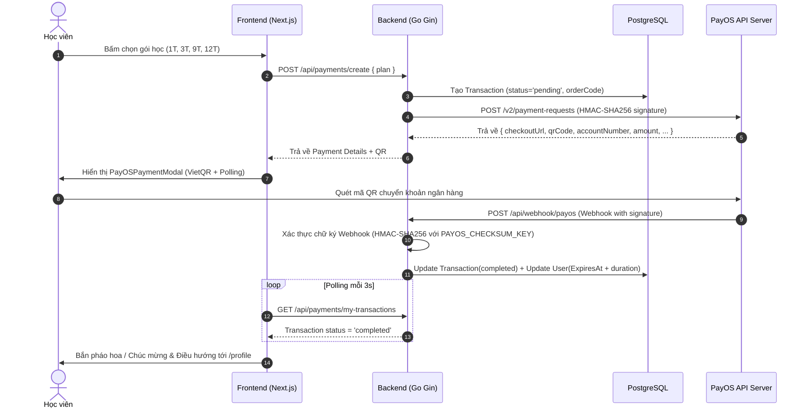

# Design Document: PayOS Integration & User Management Refinement

## 1. Overview
Hệ thống chuyển đổi cổng thanh toán tự động từ SePay sang PayOS (Open Banking / VietQR chuẩn NHNN) và cập nhật giao diện quản lý người dùng trên `/dashboard/users`.

### Mục tiêu:
1. **PayOS Gateway Integration**:
   - Backend hỗ trợ tạo link thanh toán qua PayOS API v2 (`POST /v2/payment-requests`) kèm chữ ký bảo mật HMAC-SHA256.
   - Xử lý PayOS Webhook (`POST /api/webhook/payos`) với xác thực chữ ký `PAYOS_CHECKSUM_KEY`, tự động gia hạn thời hạn học viên (`ExpiresAt`) và cập nhật trạng thái đơn hàng.
   - Hỗ trợ Mock/Fallback Mode trên môi trường Localhost khi chưa nạp API key của PayOS để đảm bảo phát triển và kiểm thử liên tục.
2. **Frontend Payment UX**:
   - Modal thanh toán dùng chung `PayOSPaymentModal.tsx` nhúng mã VietQR, STK ngân hàng, số tiền, nội dung chuyển khoản, nút mở cổng PayOS và cơ chế Polling thời gian thực.
   - Kiểm tra trạng thái đăng nhập trên cả trang `/upgrade` và trang chủ `/` (`HomePricing.tsx`), chuyển hướng mượt mà đến trang đăng nhập nếu chưa authenticate.
3. **User Management Table (`/dashboard/users`)**:
   - Xóa bỏ hoàn toàn nút và logic nạp tiền/gia hạn thủ công.
   - Thay đổi cột "Ngày tham gia" thành "Ngày hết hạn" kèm định dạng ngày và badge trực quan.

---

## 2. Architecture & Data Flow

### 2.1 Backend PayOS Service & Webhook

---

## 3. Detailed Component Specifications

### 3.1 Backend Components
1. **Model `Transaction` (`backend/internal/models/transaction.go`)**:
   - Thêm các trường:
     - `OrderCode int64` (`gorm:"uniqueIndex"`): Mã số đơn hàng số nguyên 64-bit duy nhất (dùng timestamp millisecond).
     - `PaymentLinkID string`: ID liên kết thanh toán từ PayOS.
     - `CheckoutURL string`: URL thanh toán gốc của PayOS.
     - `QRCode string`: Chuỗi dữ liệu QR VietQR do PayOS cung cấp.
2. **Service `PayOSService` (`backend/internal/services/payos_service.go`)**:
   - `CreatePaymentLink(orderCode int64, amount int, description string, returnUrl string, cancelUrl string) (*PayOSPaymentData, error)`:
     - Tính chữ ký HMAC-SHA256 theo chuỗi: `amount={amount}&cancelUrl={cancelUrl}&description={description}&orderCode={orderCode}&returnUrl={returnUrl}`.
     - Gọi PayOS API hoặc fallback sang mock nếu thiếu API keys.
   - `VerifyWebhookData(webhookData PayOSWebhookBody) (bool, *PayOSWebhookData)`:
     - Sắp xếp các key trong `data` theo thứ tự alphabet và tính HMAC-SHA256 so sánh với `signature`.
3. **Handlers**:
   - `PaymentHandler.CreatePayment`: Tạo transaction và gọi PayOS service.
   - `WebhookHandler.HandlePayOSWebhook`: Xác thực webhook payload và cập nhật `User.ExpiresAt` theo gói học (1, 3, 9, 12 tháng).

### 3.2 Frontend Components
1. **Component `PayOSPaymentModal.tsx` (`frontend/src/components/payment/PayOSPaymentModal.tsx`)**:
   - Nhận props: `isOpen`, `onClose`, `plan`, `paymentData`.
   - Hiển thị VietQR (ưu tiên ảnh từ PayOS / fallback VietQR), số tài khoản, tên tài khoản, nội dung chuyển khoản, số tiền.
   - Polling trạng thái giao dịch tự động.
2. **Trang `/upgrade` (`frontend/src/app/(main)/upgrade/page.tsx`)**:
   - Tích hợp kiểm tra auth qua `localStorage.getItem('user')` hoặc `document.cookie`.
   - Nếu chưa đăng nhập: Hiển thị toast lỗi và `router.push('/login?redirect=/upgrade')`.
   - Nếu đã đăng nhập: Gọi API `/payments/create` và mở `PayOSPaymentModal`.
3. **Trang chủ `HomePricing` (`frontend/src/components/home/HomePricing.tsx`)**:
   - Cập nhật nút "Đăng ký ngay" / "Nâng cấp Pro ngay" để kiểm tra auth.
   - Nếu chưa đăng nhập: Điều hướng tới `/login?redirect=/upgrade`.
   - Nếu đã đăng nhập: Điều hướng tới `/upgrade?plan=...` hoặc mở thanh toán trực tiếp.

### 3.3 Dashboard Users Table (`/dashboard/users`)
1. **`UserTable.tsx`**:
   - Xóa `onRecharge` prop, `rechargeUserId`, `rechargeMonths`, nút `DollarSign`.
   - Đổi cột header từ **"Ngày tham gia"** sang **"Ngày hết hạn"**.
   - Hiển thị ngày hết hạn: `user.expiresAt` (định dạng `DD/MM/YYYY`) hoặc badge "Chưa kích hoạt" / "Hết hạn".
2. **`page.tsx`**:
   - Xóa bỏ `handleRecharge` handler và `onRecharge` prop.

---

## 4. Error Handling & Edge Cases
- **Thiếu PayOS API Keys trên Localhost**: Tự động sinh `OrderCode` và mã VietQR chuẩn Ngân hàng Quân Đội (MB) kèm nội dung chuyển khoản để nhà phát triển có thể test webhook cục bộ mà không bị gián đoạn.
- **Race Condition / Double Webhook**: Bọc cập nhật giao dịch trong Database Transaction với `FOR UPDATE` trên `Transaction` để tránh gia hạn 2 lần cho cùng 1 đơn.
- **Người dùng chưa đăng nhập bấm mua**: Chặn trước khi gọi API, lưu lại URL đích và chuyển hướng người dùng đến trang đăng nhập.

---

## 5. Verification & Testing Plan
1. **Backend Unit & Integration Tests**:
   - Test tạo transaction với `OrderCode int64`.
   - Test hàm tạo chữ ký HMAC-SHA256 của PayOS service.
   - Test Webhook handler: xử lý chữ ký hợp lệ, chữ ký không hợp lệ, xử lý idempotency (không cộng dồn ngày 2 lần nếu webhook gửi lại).
2. **Frontend Unit Tests**:
   - Test `UserTable.tsx`: Không còn nút nạp tiền, hiển thị đúng cột "Ngày hết hạn".
   - Test `HomePricing.tsx`: Xử lý click chuyển hướng khi chưa đăng nhập.
3. **E2E / Manual Verification trên Localhost**:
   - Mở `http://localhost:3000/dashboard/users` kiểm tra giao diện bảng người dùng.
   - Mở `http://localhost:3000/upgrade` khi chưa đăng nhập và khi đã đăng nhập.
   - Mở `http://localhost:3000` (Trang chủ) và thử bấm nâng cấp gói.
