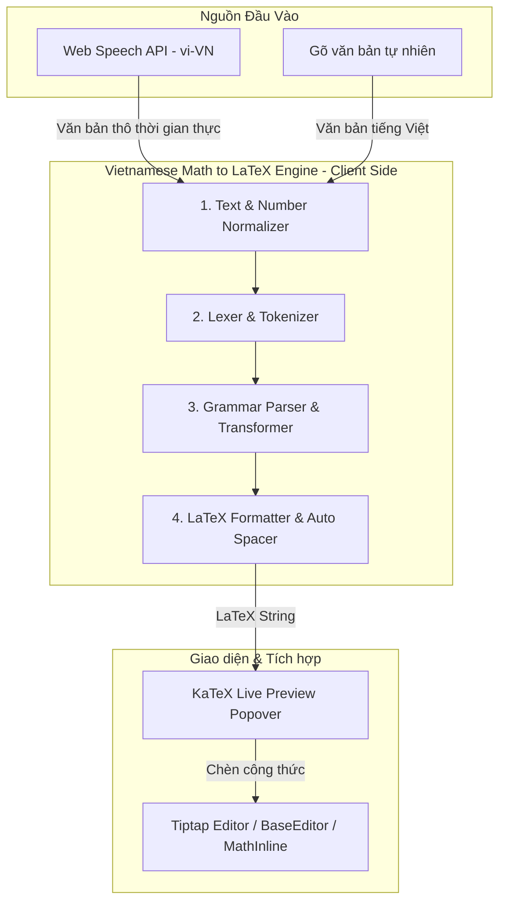

# Design Spec: Chuyển đổi Văn bản & Giọng nói tiếng Việt thành LaTeX (Vietnamese Math to LaTeX Engine)

- **Ngày tạo:** 2026-09-21
- **Trạng thái:** Approved
- **Phạm vi:** Frontend (`frontend/src/lib/math-speech/`, `BaseEditor.tsx`, `RichTextEditor.tsx`, Exam Taking, Question Creator)

---

## 1. Mục tiêu & Bối cảnh

Hệ thống **toan6789.vn** hỗ trợ học sinh làm bài tập/bài kiểm tra tự luận và giáo viên soạn thảo câu hỏi. Việc gõ công thức LaTeX thủ công trên điện thoại hoặc máy tính thường mất nhiều thời gian và gây khó khăn cho học sinh.

Mục tiêu của tính năng này là xây dựng bộ chuyển đổi **tiếng Việt sang LaTeX** (Vietnamese Math Speech/Text to LaTeX) hoạt động 100% tại Client với độ trễ siêu thấp (< 5ms), tích hợp giọng nói Web Speech API và xem trước công thức KaTeX thời gian thực (Live Preview).

---

## 2. Kiến trúc Hệ thống

---

## 3. Thiết kế Chi tiết các Module

### 3.1 Module 1: `normalizeVietnameseMath.ts`
- **Chuyển đổi số:**
  - `"không", "một", "hai", ..., "mười", "trăm", "nghìn"` $\rightarrow$ chuyển đổi chính xác thành số nguyên hoặc số thập phân (`"hai mươi ba"` $\rightarrow$ `23`, `"không phẩy hai lăm"` $\rightarrow$ `0.25`).
  - Dấu âm/dương: `"âm năm"` $\rightarrow$ `-5`, `"dương bảy"` $\rightarrow$ `+7`.
- **Chuẩn hóa biến số & ký tự đặc biệt:**
  - `"xờ / ít xì"` $\rightarrow$ `x`, `"i dài / y gờ rét"` $\rightarrow$ `y`, `"dê"` $\rightarrow$ `z`.
  - `"alpha"`, `"beta"`, `"gamma"`, `"pi / pi-thảo"`, `"delta"` $\rightarrow$ `\alpha`, `\beta`, `\gamma`, `\pi`, `\Delta`.
- **Xóa bỏ từ đệm vô nghĩa:** `"thì", "ta có", "xét", "được", "là"` trong cụm toán học.

### 3.2 Module 2: `grammarRules.ts` & `vietnameseMathTokenizer.ts`
Quy tắc ngữ pháp bao phủ toàn bộ chương trình Toán THCS/THPT:

| Nhóm toán | Tiếng Việt mẫu (Regex Pattern) | LaTeX đầu ra |
| :--- | :--- | :--- |
| **Số học & Phép tính** | `A cộng B`, `A trừ B`, `A nhân B`, `A chia B` | `A + B`, `A - B`, `A \cdot B`, `A : B` |
| **Phân số** | `phân số A trên B`, `phân số A phần B`, `A phần B` | `\frac{A}{B}` |
| **Lũy thừa & Chỉ số** | `A mũ B`, `A bình phương`, `A lập phương`, `A chỉ số B` | `A^{B}`, `A^2`, `A^3`, `A_{B}` |
| **Căn thức** | `căn bậc hai của A`, `căn bậc N của A`, `căn A` | `\sqrt{A}`, `\sqrt[N]{A}`, `\sqrt{A}` |
| **Hình học phẳng** | `tam giác ABC`, `góc ABC`, `vuông góc`, `song song` | `\Delta ABC`, `\widehat{ABC}`, `\perp`, `\parallel` |
| **Đồng dạng / Tương đương** | `đồng dạng với`, `tương đương`, `suy ra` | `\sim`, `\Leftrightarrow`, `\Rightarrow` |
| **Độ / Ký hiệu đo** | `A độ`, `độ C` | `A^\circ` |
| **Vectơ** | `vectơ AB`, `vectơ không` | `\vec{AB}`, `\vec{0}` |
| **Lượng giác** | `sin A`, `cos A`, `tan A`, `cot A` | `\sin A`, `\cos A`, `\tan A`, `\cot A` |
| **Hệ phương trình** | `hệ phương trình pt1 và pt2` | `\begin{cases} pt1 \\ pt2 \end{cases}` |

### 3.3 Module 3: Xử lý Cấu trúc Lồng nhau (Nested Expressions)
- Hỗ trợ câu phức toán học:
  - `"căn bậc hai của phân số 1 phần x cộng 1"` $\rightarrow$ `\sqrt{\frac{1}{x+1}}`
  - `"phân số x bình phương trừ 4 trên x trừ 2"` $\rightarrow$ `\frac{x^2 - 4}{x - 2}`
  - `"sin bình phương x cộng cos bình phương x bằng 1"` $\rightarrow$ `\sin^2 x + \cos^2 x = 1`

### 3.4 Module 4: Live Preview Popover (`VoiceMathAssistantModal.tsx`)
- Tích hợp trực tiếp vào nút Micro của `BaseEditor.tsx` / `RichTextEditor.tsx`.
- Giao diện gồm:
  1. Trạng thái thu âm (Sóng âm audio visualizer + nút Bật/Tắt).
  2. Dòng văn bản nhận diện thời gian thực (Interim Speech Transcript).
  3. Dòng xem trước công thức toán KaTeX (`<MathText content="..." />`).
  4. Nút **"Chèn vào bài làm"** (hoặc tự động chèn khi dừng nói) và nút **"Hủy"** (`Esc`).

---

## 4. Kế hoạch Kiểm thử & TDD (Verification Plan)

### 4.1 Unit Tests (`vietnameseMathToLatex.test.ts`)
- [x] Test bộ chuyển đổi số & số âm thập phân.
- [x] Test các phép toán cơ bản (`+`, `-`, `\times`, `\div`, `=`, `<`, `>`, `\ge`, `\le`).
- [x] Test phân số đơn giản và phân số có biểu thức đa thức.
- [x] Test căn bậc hai, căn bậc ba và căn lồng phân số.
- [x] Test hình học (tam giác, góc, độ, song song, vuông góc, đồng dạng, vectơ).
- [x] Test lượng giác và hệ phương trình.
- [x] Test câu nói hỗn hợp (văn bản chữ kèm công thức toán kẹp giữa dấu `$ ... $`).

### 4.2 Integration & Manual Verification
- Kiểm tra trực tiếp trên trình duyệt máy tính và điện thoại Android/iOS (Web Speech API).
- Kiểm tra tính năng chèn mượt mà vào Tiptap Editor tại các trang:
  - Trang làm bài thi tự luận (`/exam/[id]/take`)
  - Trang tạo/sửa câu hỏi (`/dashboard/questions/create`)
  - Trang tạo/sửa bài giảng (`/dashboard/lectures/create`)
